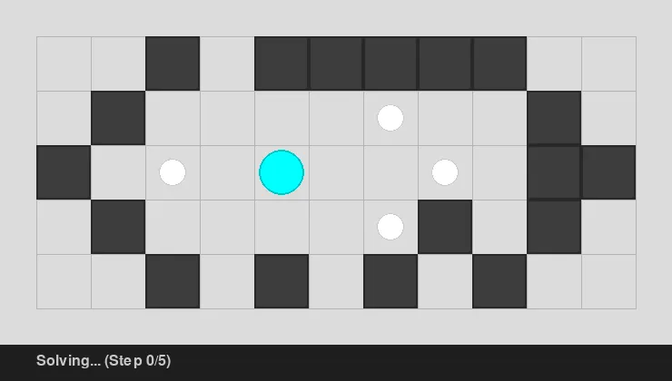

# Quell & Quell Reflect Solver

A solver and visualizer for the puzzle games *Quell* and *Quell Reflect*. This project implements the core simulation logic, a Dijkstra-based search algorithm for optimal solutions, and a suite of tools for level editing and solution visualization.

## Demo

Solution to the first level of Quell: (can be found in solutions_webp)


## Project Structure

- `questions/`: Contains level definitions in a custom text/JSON hybrid format. This includes all levels from the original *Quell* and *Quell Reflect* (and secret levels). "q-" are quell levels, "qr-" are quell reflect levels, "test-" are debugging cases for corner cases.
- `solutions/`: Stores optimal solutions in `.json` format (including steps and visited node counts).
- `solutions_webp/`: Stores optimal solutions as animated `.webp` exports.
- `board.py`: The core simulation engine. Handles piece movement, collision logic, portals, gates, and complex "Reflect" mechanics like Boxes with Spikes.
- `solver.py`: The A*/Dijkstra search implementation. Guarantees the minimum number of steps to collect all pearls.
- `solver_ui.py`: A GUI tool to run the solver and immediately visualize the result in an interactive window.
- `visualizer.py`: A `pygame`-based engine that handles smooth state interpolation and entity rendering.
- `level_editor.py`: An interactive tool for creating or modifying levels.
- `play.py`: Allows manual play of levels using arrow keys.
- `batch_record_solutions.py`: Utility to solve all levels in `questions/` and record their data.
- `batch_export.py`: Parallelized script to generate animated WebP solutions for all solvable levels.
- `test_regression.py`: A suite that verifies the solver's correctness against all known solutions.

## Usage

### Solving a level
```bash
python3 solver.py <level_id>
```

### Visualizing a solution
```bash
python3 solver_ui.py <level_id> --autoplay
```

### Manual Play
```bash
python3 play.py <level_id>
```

### Level Editor
```bash
python3 level_editor.py <level_id>
```

## Known Limitations

The target of this project was the complete set of levels for *Quell* and *Quell Reflect*. However, a few specific cases are currently outside the solver's scope:

1. **State Space Explosion:** One specific level (`qr-1970-3-4`) reaches the 1,000,000 state cutoff before an optimal solution is found. Because we prioritize guaranteeing the *minimum* number of steps, the BFS/Dijkstra search space for this specific configuration exceeds practical memory/time limits.
2. **Timing-Based Puzzles:** Three levels in *Quell Reflect* utilize real-time moving mechanism. Since this solver operates on a discrete state-transition model (one player move = one simulation resolution), it cannot solve levels where the solution depends on sub-move timing.

## Engineering Notes
- **State Interpolation:** The visualizer uses UUID-based tracking to animate entities smoothly between discrete simulation steps.
- **Infinite Loop Protection:** The simulation detects cycles in movement (e.g., droplets bouncing between portals infinitely) and removes the offending piece to allow the search to continue.
- **Optimized Serialization:** Uses `numpy` for fast grid lookups combined with JSON for complex dynamic entity state.
